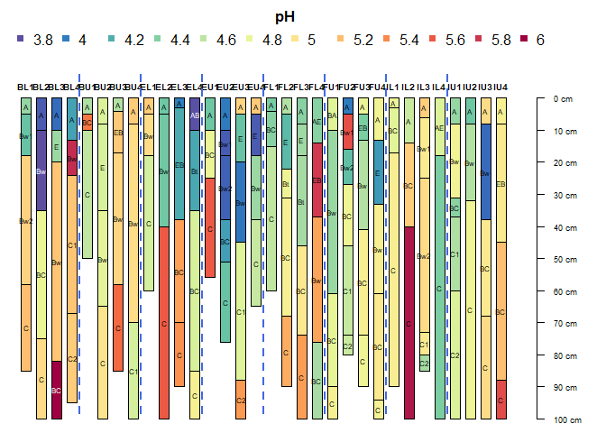
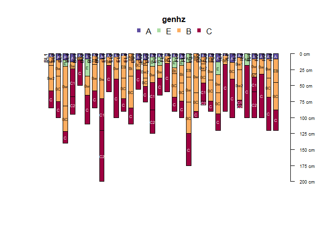
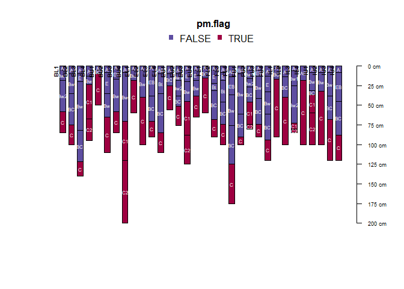
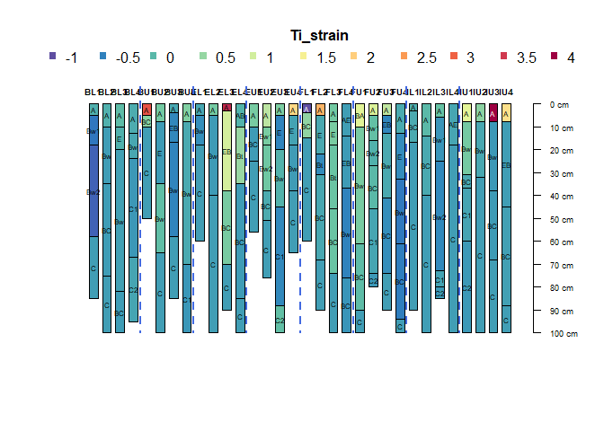
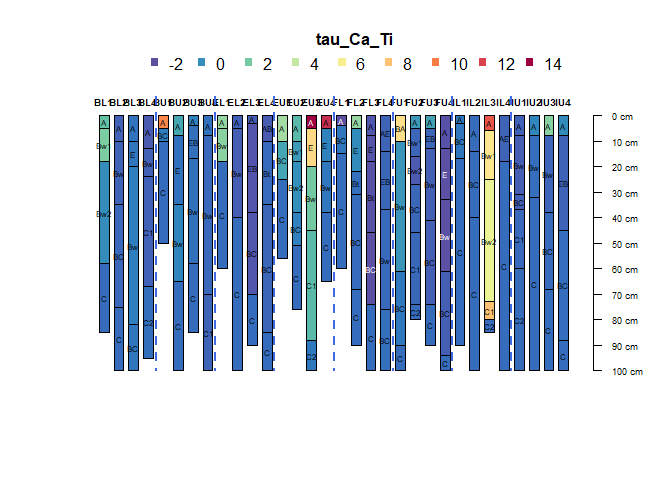

Soil Constituent Mass Balance
================
S.W. Salley
2023-10-03

- <a href="#introduction" id="toc-introduction">Introduction</a>
- <a href="#fraser-experimental-forest"
  id="toc-fraser-experimental-forest">Fraser Experimental Forest</a>
- <a href="#mass-balance" id="toc-mass-balance">Mass Balance</a>
  - <a href="#strain" id="toc-strain">Strain</a>
  - <a href="#mass-transfer" id="toc-mass-transfer">Mass Transfer</a>
  - <a href="#mass-flux" id="toc-mass-flux">Mass Flux</a>
- <a href="#still-to-do" id="toc-still-to-do">Still to do</a>

# Introduction

This is an introduction to the soil constituent mass balance approach
and calculations. The geochemical (constituent) mass balance approach is
used to quantify soil weathering by calculating volume changes through
the soil profile. The approach is based on conservation of mass and
provides a functional relationship among soil chemical composition, bulk
density, and volume change in relation to the soil’s parent material.

Mass balance functions quantify the soil’s strain (ε), mass transfer
(τ), and mass flux into and out of soil horizons. Strain is unitless and
calculated as the sum of the depth-weighted contributions from each
weathered soil horizon in its respective pedon. The mass transfer
coefficient (τ) is used to evaluate element mobility within the soil,
and mass flux is used to evaluate mobility within the landscape.

More information on the approach and calculations are from [Chadwick and
others (1990)](https://doi.org/10.1016/0169-555X(90)90012-F), [Egli and
Fitze
(2000)](https://journals.lww.com/soilsci/Fulltext/2000/05000/Formulation_of_Pedologic_Mass_Balance_Based_on.8.aspx),
[Vaughan and others (2018)](https://doi.org/10.2136/sssaj2018.02.0071)
and [Bergstrom and others
(2019)](https://doi.org/10.1016/j.geoderma.2018.07.024).

# Fraser Experimental Forest

This demo uses soil data from the Fraser Experimental Forest (FEF),
Grand County, Colorado, USA, located in the central Rocky Mountains to
demonstrate the mass balance approach. Soils were sampled from 2012-2013
along mountain landscape positions (1=summit, 2=shoulder, 3=backslope,
and 4=footslope) of upper and lower watersheds (BL, BU, EL, EU, FL, FU,
IL, and IU) in the Fraser Experiemtal Forest. Data includes morphologic,
elemental, and physical data by horizon as well as site data. (Figure
1.)


Figure 1. Fraser Experimental Forest soil locations. Soils were sampled
in 2013 along mountain landscape positions (1=summit, 2=shoulder,
3=backslope, and 4=footslope) of upper and lower watersheds (BL, BU, EL,
EU, FL, FU, IL, and IU). Data includes morphologic, elemental, and
physical data by horizon as well as site data.

To gain insight into the generation and distribution of the soil cation
pool, mass balance analysis was used on soil geochemical data to pedons
across eight soil catenas in complex mountain terrain typical of the
central Rocky Mountains. They found that mass gains are primarily
attributable to pedogenic additions of Ca to the soil mantle via
atmospheric dust, and that soil catenas on the summit landscapes were
most enriched in Ca.

We use aqp, which gives us the basic data structure for pedon data, the
SoilProfileCollection object. Install the following packages from CRAN,
and load into the current R session.

``` r
library(aqp)
```

One of the example datasets is bergstrom2019. Load bergstrom2019.

``` r
h <- read.csv('https://raw.githubusercontent.com/ncss-tech/aqp/master/misc/example-data/bergstrom2019/horizon-data.csv')
s <- read.csv('https://raw.githubusercontent.com/ncss-tech/aqp/master/misc/example-data/bergstrom2019/site-data.csv')

h$hzID <- NULL
s$id <- NULL
colnames(h)[1] <- "pedon" 

depths(h) <- pedon ~ top + bottom
site(h) <- s
hzdesgnname(h) <- 'name'
```

Explore soil groupings.

``` r
# Groups
h$group <- factor(substr(profile_id(h), 0, 2))

# Plots
par(mar = c(0, 0, 3, 2))
plotSPC(trunc(h, 0, 100), color = 'pH', id.style = 'top', width = 0.33, name.style = 'center-center')
groupedProfilePlot(trunc(h, 0, 100), groups = 'group', color = 'pH', id.style = 'top', width = 0.33, 
                   name.style = 'center-center', group.name.offset = -15)
```

<!-- -->

# Mass Balance

Mass balance functions quantify strain (ε), mass transfer (τ), and mass
flux into and out of soil horizons. More information on the approach
test dataset are at [Bergstrom and others
(2019)](https://doi.org/10.1016/j.geoderma.2018.07.024).

## Strain

Strain (ε), or volume change, is estimated by the ratio of volume change
during weathering with respect to the volume of the initial parent
material. It is calculated to determine the amount or sense of
deformation in soils using an assumed isovolume frame of reference, such
as an insoluble host mineral of immobile element (usually Titanium or
Zirconium). Positive strains infer dilation and negative strains
represent collapse. Strain (ε i,w) is defined as:

$$ ε_{i.ws} =  \frac{ρ_{pm} C_{i,pm}}{ρ_{ws} C_{i,ws}} - 1 $$ where ρ is
soil bulk density, Ci is the concentration of an (i) immobile reference
element in the (ws) weathered soil horizon or the p the (pm) soil parent
material.

The following function can be used to compute volumetric strain for soil
horizons based on immobile reference on soil data where the lowest
horizon for each pedon is considered the parent material of the soil:

``` r
Strain <- function(x, bulkdensity, iref) { 
  x@horizons$strain <- profileApply(x, FUN= function(x) { 
    ((tail(x[[bulkdensity]], 1) * tail(x[[iref]]/1000, 1)) / 
       (x[[bulkdensity]] * x[[iref]]/1000)) -1  } )
  x$strain 
}
```

Now calculate the elemental strain for Titanium (Ti) and Zirconium (Zr)
as the immobile reference. Note that the lowest depth for each pedon is
has a zero volume change.

``` r
h$Ti_strain <- Strain(h, "BD","Ti_ppm")
h$Zr_strain <- Strain(h, "BD","Zr_ppm")
#
groupedProfilePlot(trunc(h, 0, 100), groups = 'group', color = 'Ti_strain', id.style = 'top', width = 0.33, 
                   name.style = 'center-center', group.name.offset = -15)
```

<!-- -->

``` r
groupedProfilePlot(trunc(h, 0, 100), groups = 'group', color = 'Zr_strain', id.style = 'top', width = 0.33, 
                   name.style = 'center-center', group.name.offset = -15)
```

<!-- -->

## Mass Transfer

Mass Transfer is the horizon’s element mobility in the soil per mass
fraction of the parent material. The open-system Mass Transfer
Coefficient for the element j (τj,w) is defined as:

$$ τ_{j.ws} =  \left(\frac{ρ_{ws} C_{j,ws}}{ρ_{pm} C_{j,pm}} (ε_{i.ws}+ 1)\right) - 1 $$

where ρ is soil bulk density. Cj,w is the concentration of a mobile
chemical element j of the the weathered soil horizon w, Cj,p is the
concentration of a mobile chemical element j of the parent material p, ε
j,w is the strain, or the volumetric changes estimated by the ratio of
volume change during weathering with respect tot he volume of the
initial material.

The following function can be used to compute mass transfer for soil
horizons based on immobile reference on soil data and where the lowest
horizon for each pedon is considered the parent material of the soil:

``` r
MassTransfer <- function(x, strain, bulkdensity, mobile) { 
  x@horizons$MassT <-profileApply(x, FUN = function(x) { 
    ((x[[bulkdensity]] * x[[mobile]]/1000) /
    (tail(x[[bulkdensity]], 1) * tail(x[[mobile]]/1000, 1)) *
    (x[[strain]] + 1) ) -1  })
  x$MassT
}
```

Now calculate the mass transfer of the mobile cation Calcium (ca) using
Titanium (Ti) as the index, or immobile reference.

``` r
h$tau_Ca_Ti <- MassTransfer(h, "Ti_strain", "BD", "Ca_ppm")
#
groupedProfilePlot(trunc(h, 0, 100), groups = 'group', color = 'tau_Ca_Ti', id.style = 'top', width = 0.33, 
                   name.style = 'center-center', group.name.offset = -15)
```

<!-- -->

## Mass Flux

Mass flux values estimate elemental gain or loss of a mobile element
from the soil profile. The weathering mass flux co

$$ mass_{j,flux} = ρ_{p} ∆Z_{w} \frac{1}{ε_{i.w}+ 1} C_{j,p}τ_{j,w} $$

where ρ is bulk density, w is the weathered soil horizon, p is parent
material, and Cj,p is the concentration of element j, τj,w is the
open-system mass transport function for the element j, and z is the
thickness of the soil horizons (from Egli etal 2000). The mass fluxes
from horizons contributing to a soil profile were summed to obtain a
weathering mass flux for the entire soil profile.

The following function can be used to compute mass flux for soil
horizons based on immobile reference on soil data and where the lowest
horizon for each pedon is considered the parent material of the soil:

``` r
MassFlux <- function(x, Strain, MassTrans, bulkdensity, mobile) { 
  x@horizons$flux <- profileApply(x, FUN = function(x) { 
    tail(x[[bulkdensity]], 1)  *
    tail(x[[mobile]]/1000, 1) *
    x[[MassTrans]] *
    ((x[[x@depthcols[2] ]] - x[[x@depthcols[1] ]] )/100) *
    (1/(x[[Strain]]+1)) }) 
  x$flux 
}
```

Now calculate the horizon Ca mass flux, using Strain() calculation with
Ti as the immobile reference

``` r
round(MassFlux(h, "Ti_strain", "tau_Ca_Ti", "BD", "Ca_ppm"),3)
h$Ca_Massflux <- round(MassFlux(h, "Ti_strain", "tau_Ca_Ti", "BD", "Ca_ppm"),3)
#
groupedProfilePlot(trunc(h, 0, 100), groups = 'group', color = 'Ca_Massflux', id.style = 'top', width = 0.33, 
                   name.style = 'center-center', group.name.offset = -15)
```

<!-- -->

The following function can be used to compute mass flux for soil pedons
based on immobile reference on soil data and where the lowest horizon
for each pedon is considered the parent material of the soil to
calculate pedon mass flux.

``` r
profileApply(h, FUN = function(x) { sum(x$Ca_Massflux) -1 })
h$pflux <- profileApply(h, FUN = function(x) { sum(x$Ca_Massflux) -1 })
```

# Still to do

Set up tests to determine immobile reference.

Write function for enrichment factor (equation 7 from Vaughan etal
2018):
$$ \frac{C_{ws}}{C_{pm}} = \frac{ρ_{pm}}{ρ_{ws}} * \frac{1}{ε_{i.ws}+1} * (1+τ_j,ws) $$
