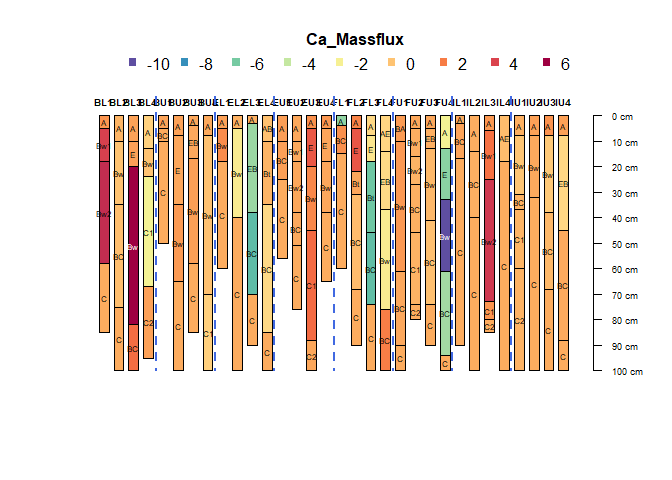
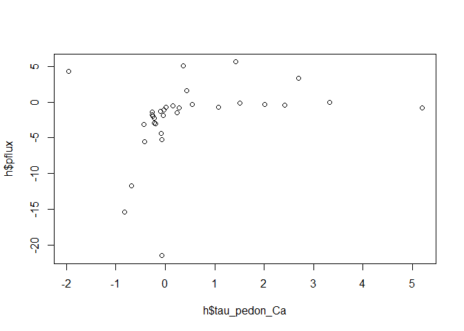

Soil Constituent Mass Balance
================
S.W. Salley, D. E. Beaudette
2023-10-21

- <a href="#introduction" id="toc-introduction">Introduction</a>
- <a href="#fraser-experimental-forest"
  id="toc-fraser-experimental-forest">Fraser Experimental Forest</a>
  - <a href="#sample-data-set" id="toc-sample-data-set">Sample Data Set</a>
  - <a href="#soil-parent-material" id="toc-soil-parent-material">Soil
    Parent Material</a>
- <a href="#mass-balance" id="toc-mass-balance">Mass Balance</a>
  - <a href="#strain" id="toc-strain">Strain</a>
  - <a href="#mass-transfer" id="toc-mass-transfer">Mass Transfer</a>
  - <a href="#mass-flux" id="toc-mass-flux">Mass Flux</a>
- <a href="#still-to-do" id="toc-still-to-do">Still to do</a>
  - <a href="#immobile-reference-test"
    id="toc-immobile-reference-test">Immobile reference test</a>
  - <a href="#rock-fragment-offset" id="toc-rock-fragment-offset">Rock
    fragment offset</a>
  - <a href="#enrichment-factor" id="toc-enrichment-factor">Enrichment
    factor</a>
  - <a href="#accumulation-rate" id="toc-accumulation-rate">Accumulation
    rate</a>

# Introduction

This is an introduction to the soil constituent mass balance approach
and calculations. The geochemical (constituent) mass balance approach is
used to quantify soil weathering by calculating volume changes through
the soil profile. The approach is based on conservation of mass and
provides a functional relationship among soil chemical composition, bulk
density, and volume change in relation to the soil’s parent material.

Mass balance functions quantify the soil’s strain (ε), mass transfer
(τ), and mass flux into and out of soil horizons. Strain is unitless and
calculated as the sum of the depth-weighted contributions from each
weathered soil horizon in its respective pedon. The mass transfer
coefficient (τ) is used to evaluate element mobility within the soil,
and mass flux is used to evaluate mobility within the landscape.

More information on the approach and calculations are from [Chadwick and
others (1990)](https://doi.org/10.1016/0169-555X(90)90012-F), [Egli and
Fitze
(2000)](https://journals.lww.com/soilsci/Fulltext/2000/05000/Formulation_of_Pedologic_Mass_Balance_Based_on.8.aspx),
[Heckman and Rasmussen
(2011)](https://doi.org/10.1016/j.geoderma.2011.05.003), [Vaughan and
others (2018)](https://doi.org/10.2136/sssaj2018.02.0071), [Bergstrom
and others (2019)](https://doi.org/10.1016/j.geoderma.2018.07.024), and
[Bower and others
(2023)](https://doi.org/10.1016/j.geoderma.2023.116677).

# Fraser Experimental Forest

This demo uses soil data from the Fraser Experimental Forest (FEF),
Grand County, Colorado, USA, located in the central Rocky Mountains to
demonstrate the mass balance approach. Soils were sampled from 2012-2013
along mountain landscape positions (1=summit, 2=shoulder, 3=backslope,
and 4=footslope) of upper and lower watersheds (BL, BU, EL, EU, FL, FU,
IL, and IU) in the Fraser Experiemtal Forest. Data includes morphologic,
elemental, and physical data by horizon as well as site data. (Figure
1.)


FEF geochemical soil data was used to gain insight into the generation
and distribution of the soil cation pool, mass balance analysis was used
on soil geochemical data to pedons across eight soil catenas in complex
mountain terrain typical of the central Rocky Mountains. They found that
mass gains are primarily attributable to pedogenic additions of Ca to
the soil mantle via atmospheric dust, and that soil catenas on the
summit landscapes were most enriched in Ca.

## Sample Data Set

We use aqp, which gives us the basic data structure for pedon data, the
SoilProfileCollection object. Install the following packages from
github, and load into the current R session.

``` r
library(aqp)
```

Load FEF test data from github.

``` r
h <- read.csv('https://raw.githubusercontent.com/ncss-tech/aqp/master/misc/example-data/bergstrom2019/horizon-data.csv')
s <- read.csv('https://raw.githubusercontent.com/ncss-tech/aqp/master/misc/example-data/bergstrom2019/site-data.csv')

h$hzID <- NULL
s$id <- NULL
colnames(h)[1] <- "pedon" 
colnames(s)[11] <- "st_ti" 

depths(h) <- pedon ~ top + bottom
site(h) <- s
hzdesgnname(h) <- 'name'
```

Explore soil groupings.

``` r
# Groups
h$group <- factor(substr(profile_id(h), 0, 2))

# Plots
par(mar = c(0, 0, 3, 2))
plotSPC(trunc(h, 0, 100), color = 'pH', id.style = 'top', width = 0.33, name.style = 'center-center')
groupedProfilePlot(trunc(h, 0, 100), groups = 'group', color = 'pH', id.style = 'top', width = 0.33, 
                   name.style = 'center-center', group.name.offset = -15)
```

<!-- -->

## Soil Parent Material

One limitation of the mass balance approach (and other generalize
indices of soil development) [Koop and others
(2020)](https://www.sciencedirect.com/science/article/pii/S0016706119304069),
is the reliance on parent material information.

FEF soil data is structured so that the deepest horizon from each
respective soil pit is considered the soil’s parent material.

``` r
profileApply(h, FUN = function(x) { tail(h$name, 1) })
```

    ## BL1 BL2 BL3 BL4 BU1 BU2 BU3 BU4 EL1 EL2 EL3 EL4 EU1 EU2 EU3 EU4 FL1 FL2 FL3 FL4 
    ## "C" "C" "C" "C" "C" "C" "C" "C" "C" "C" "C" "C" "C" "C" "C" "C" "C" "C" "C" "C" 
    ## FU1 FU2 FU3 FU4 IL1 IL2 IL3 IL4 IU1 IU2 IU3 IU4 
    ## "C" "C" "C" "C" "C" "C" "C" "C" "C" "C" "C" "C"

Another approach would be either manually flag the parent material
horizon, or by described genetic horizon, such as a C horizon.

``` r
# Generalize horizons
h$genhz <- generalize.hz(
  h$name,
  new = c('A', 'E', 'B', 'C'),
  pattern = c('A', 'E', 'B', '^C')
  )

# flag C horizons as the "parent material"
h$pm.flag <- ifelse(h$genhz == 'C', TRUE, FALSE)

# note that there could be multiple horizons meeting this criteria
plotSPC(h, color = 'genhz', width = 0.33, name.style = 'center-center')
```

<!-- -->

``` r
plotSPC(h, color = 'pm.flag', width = 0.33, name.style = 'center-center')
```

<!-- -->

``` r
# top depth of shallowest C horizon
head(depthOf(h, pattern = '^C', FUN = min, top = TRUE))
```

    ##   pedon hzID top name pattern
    ## 1   BL1    4  58    C      ^C
    ## 2   BL2    8  75    C      ^C
    ## 3   BL3   13 122    C      ^C
    ## 4   BL4   16  24   C1      ^C
    ## 5   BU1   20  10    C      ^C
    ## 6   BU2   24  65    C      ^C

Note: Please contact authors if you have other approaches and would like
to contribute code or test data to expand how application of parent
material information can better be incorporated in horizon, pedon, site,
and landscape data.

# Mass Balance

Mass balance functions quantify strain (ε), mass transfer (τ), and mass
flux into and out of soil horizons. More information on the approach
test dataset are at [Bergstrom and others
(2019)](https://doi.org/10.1016/j.geoderma.2018.07.024).

## Strain

Strain (ε), or volume change, is estimated by the ratio of volume change
during weathering with respect to the volume of the initial parent
material. It is calculated to determine the amount or sense of
deformation in soils using an assumed isovolume frame of reference, such
as an insoluble host mineral of immobile element (usually Titanium or
Zirconium). Positive strains infer dilation and negative strains
represent collapse. Strain (ε i,w) is defined as:

$$ε_{i.ws} =  \frac{ρ_{pm} C_{i,pm}}{ρ_{ws} C_{i,ws}} - 1$$

where ρ is soil bulk density, Ci is the concentration of an (i) immobile
reference element in the (ws) weathered soil horizon or the p the (pm)
soil parent material.

The following function can be used to compute volumetric strain for soil
horizons based on immobile reference on soil data. Default is where the
lowest horizon for each pedon is considered the parent material of the
soil,

``` r
Strain <- function(x, bulkdensity, iref, pm.flag = TRUE) { 
  x$strain <- profileApply(x, FUN= function(x) { 
    if (!pm.flag) { 
      tail(x[[bulkdensity]], 1) * tail(x[[iref]]/1000, 1) /
      (x[[bulkdensity]] * x[[iref]]/1000) -1  }
    else {
      x.pm <- horizons(x)[x$pm.flag == T,]
      (mean(x.pm[[bulkdensity]]) * mean(x.pm[[iref]]/1000)) /
      (x[[bulkdensity]] * x[[iref]]/1000) -1 }}) 
  x$strain 
}
```

``` r
# update 10/20/2023, inclusion of pm.flag = TRUE option
head(Strain(h, "BD","Ti_ppm"))
```

    ## [1]  1.532578e-01 -3.194869e-01 -5.151555e-01  2.220446e-16  1.540487e-01
    ## [6] -1.093630e-02

``` r
head(Strain(h, "BD","Ti_ppm", T))
```

    ## [1]  1.532578e-01 -3.194869e-01 -5.151555e-01  2.220446e-16  1.540487e-01
    ## [6] -1.093630e-02

``` r
head(Strain(h, "BD","Ti_ppm", F))
```

    ## [1]  1.532578e-01 -3.194869e-01 -5.151555e-01  2.220446e-16  1.540487e-01
    ## [6] -1.093630e-02

``` r
# sanity check
Strain(h, "BD","Ti_ppm") == Strain(h, "BD","Ti_ppm", T) 
```

    ##   [1] TRUE TRUE TRUE TRUE TRUE TRUE TRUE TRUE TRUE TRUE TRUE TRUE TRUE TRUE TRUE
    ##  [16] TRUE TRUE TRUE TRUE TRUE TRUE TRUE TRUE TRUE TRUE TRUE TRUE TRUE TRUE TRUE
    ##  [31] TRUE TRUE TRUE TRUE TRUE TRUE TRUE TRUE TRUE TRUE TRUE TRUE TRUE TRUE TRUE
    ##  [46] TRUE TRUE TRUE TRUE TRUE TRUE TRUE TRUE TRUE TRUE TRUE TRUE TRUE TRUE TRUE
    ##  [61] TRUE TRUE TRUE TRUE TRUE TRUE TRUE TRUE TRUE TRUE TRUE TRUE TRUE TRUE TRUE
    ##  [76] TRUE TRUE TRUE TRUE TRUE TRUE TRUE TRUE TRUE TRUE TRUE TRUE TRUE TRUE TRUE
    ##  [91] TRUE TRUE TRUE TRUE TRUE TRUE TRUE TRUE TRUE TRUE TRUE TRUE TRUE TRUE TRUE
    ## [106] TRUE TRUE TRUE TRUE TRUE TRUE TRUE TRUE TRUE TRUE TRUE TRUE TRUE TRUE TRUE
    ## [121] TRUE TRUE TRUE TRUE TRUE TRUE TRUE TRUE TRUE TRUE

``` r
Strain(h, "BD","Ti_ppm") == Strain(h, "BD","Ti_ppm", F)
```

    ##   [1]  TRUE  TRUE  TRUE  TRUE  TRUE  TRUE  TRUE  TRUE  TRUE  TRUE  TRUE  TRUE
    ##  [13]  TRUE FALSE FALSE FALSE FALSE  TRUE  TRUE  TRUE  TRUE  TRUE  TRUE  TRUE
    ##  [25]  TRUE  TRUE  TRUE  TRUE FALSE FALSE FALSE FALSE  TRUE  TRUE  TRUE  TRUE
    ##  [37]  TRUE  TRUE  TRUE  TRUE  TRUE  TRUE  TRUE  TRUE  TRUE  TRUE  TRUE  TRUE
    ##  [49]  TRUE  TRUE  TRUE  TRUE  TRUE  TRUE FALSE FALSE FALSE FALSE FALSE  TRUE
    ##  [61]  TRUE  TRUE  TRUE  TRUE  TRUE  TRUE  TRUE  TRUE  TRUE  TRUE  TRUE  TRUE
    ##  [73]  TRUE  TRUE  TRUE  TRUE  TRUE  TRUE  TRUE  TRUE  TRUE  TRUE  TRUE  TRUE
    ##  [85]  TRUE FALSE FALSE FALSE FALSE FALSE FALSE  TRUE  TRUE  TRUE  TRUE  TRUE
    ##  [97]  TRUE  TRUE  TRUE  TRUE  TRUE  TRUE  TRUE  TRUE  TRUE  TRUE  TRUE FALSE
    ## [109] FALSE FALSE FALSE FALSE  TRUE  TRUE FALSE FALSE FALSE FALSE FALSE  TRUE
    ## [121]  TRUE  TRUE  TRUE  TRUE  TRUE  TRUE  TRUE  TRUE  TRUE  TRUE

Now calculate the elemental strain for Titanium (Ti) and Zirconium (Zr)
as the immobile reference. Note that the lowest depth for each pedon is
has a zero volume change.

``` r
h$Ti_strain <- Strain(h, "BD","Ti_ppm")
h$Zr_strain <- Strain(h, "BD","Zr_ppm")
```

``` r
groupedProfilePlot(trunc(h, 0, 100), groups = 'group', color = 'Ti_strain', id.style = 'top', width = 0.33, 
                   name.style = 'center-center', group.name.offset = -15)
```

<!-- -->

``` r
groupedProfilePlot(trunc(h, 0, 100), groups = 'group', color = 'Zr_strain', id.style = 'top', width = 0.33, 
                   name.style = 'center-center', group.name.offset = -15)
```

<!-- -->

## Mass Transfer

Mass Transfer is the horizon’s element mobility in the soil per mass
fraction of the parent material. The open-system Mass Transfer
Coefficient for the element j (τj,w) is defined as:

$$τ_{j.ws} =  \left(\frac{ρ_{ws} C_{j,ws}}{ρ_{pm} C_{j,pm}} (ε_{i.ws}+ 1)\right) - 1$$

where ρ is soil bulk density. Cj,w is the concentration of a mobile
chemical element j of the the weathered soil horizon w, Cj,p is the
concentration of a mobile chemical element j of the parent material p, ε
j,w is the strain, or the volumetric changes estimated by the ratio of
volume change during weathering with respect tot he volume of the
initial material.

The following function can be used to compute mass transfer for soil
horizons based on immobile reference on soil data and where the lowest
horizon for each pedon is considered the parent material of the soil:

``` r
# only the Strain function currently has the pm.flag = TRUE option, 
# contributors are testing different methods, please contact s. salley if you have ideas. 

MassTransfer <- function(x, strain, bulkdensity, mobile) { 
  x@horizons$MassT <-profileApply(x, FUN = function(x) { 
    ((x[[bulkdensity]] * x[[mobile]]/1000) /
    (tail(x[[bulkdensity]], 1) * tail(x[[mobile]]/1000, 1)) *
    (x[[strain]] + 1) ) -1  })
  x$MassT
}
```

Now calculate the mass transfer of the mobile cation Calcium (ca) using
Titanium (Ti) as the index, or immobile reference.

``` r
h$tau_Ca_Ti <- MassTransfer(h, "Ti_strain", "BD", "Ca_ppm")
#
groupedProfilePlot(trunc(h, 0, 100), groups = 'group', color = 'tau_Ca_Ti', id.style = 'top', width = 0.33, 
                   name.style = 'center-center', group.name.offset = -15)
```

<!-- -->

## Mass Flux

Mass flux values estimate elemental gain or loss of a mobile element
from the soil profile. The weathering mass flux co

$$mass_{j,flux} = ρ_{p} ∆Z_{w} \frac{1}{ε_{i.w}+ 1} C_{j,p}τ_{j,w}$$

where ρ is bulk density, w is the weathered soil horizon, p is parent
material, and Cj,p is the concentration of element j, τj,w is the
open-system mass transport function for the element j, and z is the
thickness of the soil horizons (from Egli etal 2000). The mass fluxes
from horizons contributing to a soil profile were summed to obtain a
weathering mass flux for the entire soil profile.

The following function can be used to compute mass flux for soil
horizons based on immobile reference on soil data and where the lowest
horizon for each pedon is considered the parent material of the soil:

``` r
MassFlux <- function(x, strain, MassTrans, bulkdensity, mobile) { 
  x@horizons$flux <- profileApply(x, FUN = function(x) { 
    tail(x[[bulkdensity]], 1)  *
    ((x[[x@depthcols[2] ]] - x[[x@depthcols[1] ]] )/100) *
    (1/(x[[strain]]+1)) *
    tail(x[[mobile]]/1000, 1) *
    x[[MassTrans]] }) 
  x$flux 
}
```

Now calculate the horizon Ca mass flux, using MassFlux():

``` r
round(MassFlux(h, "Ti_strain", "tau_Ca_Ti", "BD", "Ca_ppm"),3)
h$Ca_Massflux <- round(MassFlux(h, "Ti_strain", "tau_Ca_Ti", "BD", "Ca_ppm"),3)
#
groupedProfilePlot(trunc(h, 0, 100), groups = 'group', color = 'Ca_Massflux', id.style = 'top', width = 0.33, 
                   name.style = 'center-center', group.name.offset = -15)
```

<!-- -->

The following function can be used to compute mass flux for soil pedons
based on immobile reference on soil data and where the lowest horizon
for each pedon is considered the parent material of the soil to
calculate pedon mass flux.

``` r
profileApply(h, FUN = function(x) { sum(x$Ca_Massflux) -1 })
h$pflux <- profileApply(h, FUN = function(x) { sum(x$Ca_Massflux) -1 })
```

# Still to do

## Immobile reference test

The more ‘immobile’ element would show less of a relationship between
strain and any soil property, or the movement of Ti or Zr is considered
independent of the % clay or % sand. There is an assumption of mobility
of sand and clay sized particles via translocation, so Whichever element
is found to be less mobile is used as the benchmark to calculate strain.

## Rock fragment offset

Rock fragment offset (equation 3 from [Heckman and Ramussen,
2011](https://doi.org/10.1016/j.geoderma.2011.05.003)).

$$mass_{j,flux} = ρ_{p} C_{j,p}τ_{j,w} \left[Z_{w}(1-η_w) \right]* \left(\frac{1}{ε_{i.w}+ 1} \right)$$

``` r
MassFlux <- function(x, Strain, MassTrans, bulkdensity, mobile, rockfrag) { 
  x@horizons$flux <- profileApply(x, FUN = function(x) { 
    tail(x[[bulkdensity]], 1)  *
    tail(x[[mobile]]/1000, 1) *
    x[[MassTrans]] *
    (((x[[x@depthcols[2] ]] - x[[x@depthcols[1] ]] )/100) (1-x[[rockfrag]]))*
    (1/(x[[Strain]]+1)) }) 
  x$flux 
}
```

To test this, rock fragment data needs to be added to the bergstrom2019
data set.

## Enrichment factor

Enrichment factor (equation 7 from [Vaughan and others,
2018](https://doi.org/10.2136/sssaj2018.02.0071)):

$$\frac{C_{ws}}{C_{pm}} = \frac{ρ_{pm}}{ρ_{ws}} * \frac{1}{ε_{i.ws}+1} * (1+τ_j,ws)$$

``` r
Enrichment <- function(x, Strain, MassTrans, bulkdensity, mobile) { 
  x@horizons$enrichment <- profileApply(x, FUN = function(x) { 
    (tail(x[[bulkdensity]], 1) / x[[bulkdensity]])  *
    (1/(x[[Strain]]+1)) *
    (1+  x[[MassTrans]] ) })
  x$enrichment
}
```

## Accumulation rate

Accumulation rate (equation 8 from [Vaughan and others,
2018](https://doi.org/10.2136/sssaj2018.02.0071)):

$$accumuilation rate = \frac{ \overline{C_{j,ws}} }{t}$$ where
$\overline{C_{j,ws}}$ is the weighted average of concentration of
element j in g m-2 in weathered soil (ws) and t is time in years.

-end-
